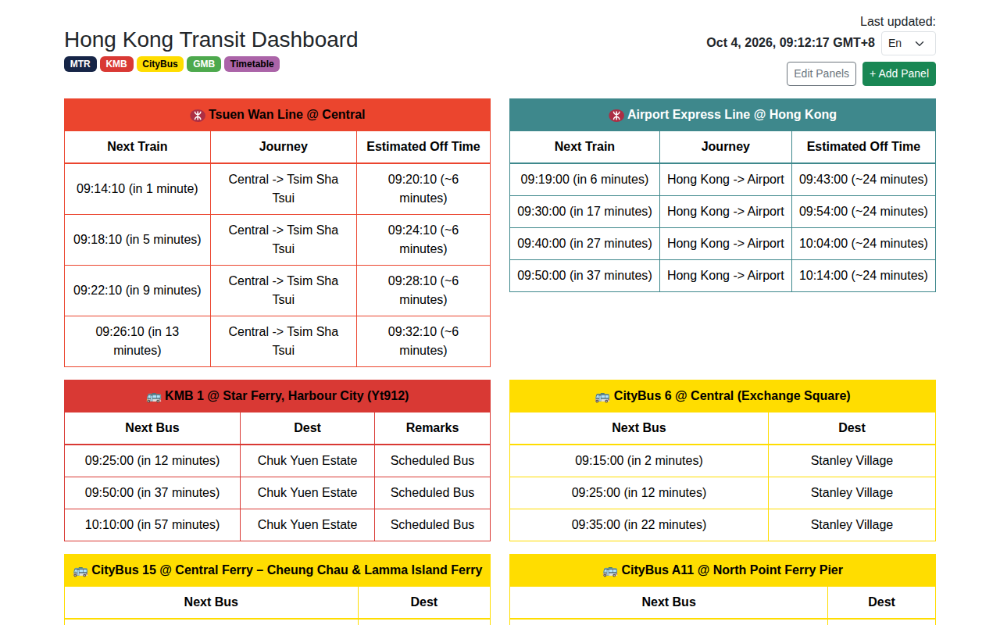

# Hong Kong Transit Dashboard

A single-page dashboard that shows live arrival times for the Hong Kong transit routes you care about, side by side: MTR, KMB, Citybus, green minibus, and any service you have a timetable for.

**Live demo:** https://bnomb3.github.io/hk-transit-dashboard/



## Features

- **Live ETAs** from the Hong Kong government open-data APIs, one panel per route/stop.
- **Estimated arrival at your destination** when a panel has both a boarding stop and a journey time (MTR journey times are looked up automatically).
- **Custom timetables:** paste the departure times of a residents' or company shuttle and get the same "next departure" panel, with separate weekday and weekend/public-holiday times.
- **Add, remove and reorder panels** with a step-by-step wizard and drag-and-drop. Your layout is saved in the browser's `localStorage`.
- **Three languages:** English, 繁體中文, 简体中文.
- **No backend.** The production build is fully static and talks to the open-data APIs directly from the browser.

| Operator | Source |
|----------|--------|
| MTR | `rt.data.gov.hk/v1/transport/mtr` (ETA), `www.mtr.com.hk` (journey time) |
| KMB | `data.etabus.gov.hk/v1/transport/kmb` |
| Citybus | `rt.data.gov.hk/v2/transport/citybus` |
| Green minibus | `data.etagmb.gov.hk` |
| Custom timetable | Times you enter; stored in your browser only |

## Getting started

Requires Node.js 20 or newer.

```bash
npm install
npm run dev       # http://localhost:5173
```

Other scripts:

```bash
npm run build     # production build to dist/
npm run preview   # serve the production build locally
npm test          # vitest in watch mode
npx vitest run    # run tests once
```

## Using the dashboard

- **+ Add Panel** opens the wizard: pick an operator, enter a route, then choose direction, boarding stop and (optionally) an alighting stop and journey time.
- For a service with no live data, pick **Timetable** in the wizard and enter a name, origin, destination and the departure times (24-hour, separated by spaces, commas or new lines). Leave the weekend/holiday box empty to use the weekday times every day. Add a second panel for the return direction.
- **Edit Panels** lets you delete panels or drag them into a new order.
- The first visit loads a sample set of panels. To get back to it, clear the `transit_panels` key in `localStorage`.

## Deploying to GitHub Pages

The repo includes a workflow, `.github/workflows/deploy.yml`, that tests, builds and publishes `dist/` on every push to `main`.

One-time setup: in the GitHub repository, go to **Settings → Pages** and set **Source** to **GitHub Actions**. After the next push to `main` (or a manual run of the workflow), the site is available at `https://<user>.github.io/<repo>/`.

The build uses relative asset paths (`base: './'` in `vite.config.js`), so it works under any sub-path or on any other static host without changes.

## How API calls are routed

`src/api.js` picks the base URL for each operator:

- **Development** (`npm run dev`): requests go to `/api/*` and are forwarded by the Vite proxy in `vite.config.js`.
- **Production** (`npm run build`): requests go straight to the upstream endpoints, which all send `Access-Control-Allow-Origin: *`.

## Updating static data

MTR station lists and Hong Kong public holidays live in `src/data/` and are generated by a script (needs Python with `requests` and `opencc`):

```bash
cd scripts && python data.py
```

Public holidays decide whether a custom timetable uses its weekday or its weekend/holiday times.

## Project layout

```
src/
  App.jsx                 dashboard shell, language switcher, panel grid
  api.js                  API base URLs (dev proxy vs. direct)
  timetable.js            parser for user-entered departure times
  hooks/usePanels.js      panel list, defaults, localStorage persistence
  components/             one panel per operator, plus PanelWrapper
  components/wizard/      Add Panel wizard
  data/                   MTR station data, public holidays
  i18n/                   i18next setup and locale files
scripts/data.py           regenerates MTR and holiday data
```

See [AGENT.md](AGENT.md) for architecture notes aimed at contributors and coding agents.

## License

[MIT](LICENSE)

## Data and disclaimer

Arrival data comes from [DATA.GOV.HK](https://data.gov.hk/) and the transport operators. This project is not affiliated with or endorsed by MTR, KMB, Citybus or the Transport Department, and ETAs are shown as provided, without any guarantee of accuracy.
